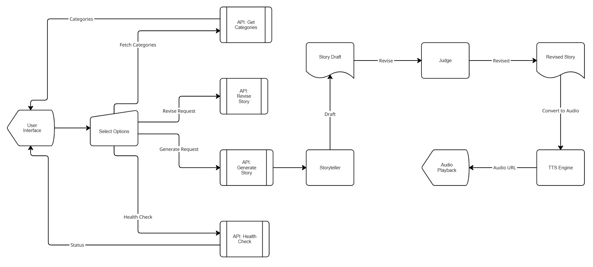

# Bedtime Stories — LLM + TTS (Hippocratic AI Take‑Home)

**Live App:** https://bedtime-stories-blue.vercel.app/  
**Public APIs:** https://bedtime-stories-m8xq.onrender.com/

This is submission to Hippocratic AI taek-home assignment. This repo contains a bedtime‑story generator for children ages **5–10**. It uses a **Storyteller** (GPT‑3.5) and a hidden **Judge** pass to improve structure, tone, safety, and length. Audio playback uses backend **gTTS** returned as an inline data URL.

---

## Features

- **Kid‑friendly stories (600–900 words)** with clear beginning–middle–end, gentle stakes, positive moral.
- **Categories**: Magic Adventure, Epic Quest, Mystery, Funny, Friends & Family, Furry Friends, Space Adventure, Boo!
- **Age brackets**: 5–6, 7–8, 9–10 influence vocabulary and complexity.
- **Judge layer** (backend, hidden) that revises drafts for structure, tone, length, and safety.
- **TTS playback**: Play/Pause/Replay with animated equalizer (moves only while audio plays).
- **Create ↔ Play** two‑panel UI with smooth transitions; **Edit** feedback flows back through the Judge.
- **“Surprise me”** random generator and “Tell me a little…” prompt flow.
- **Request throttling**: controls disabled while generating/revising to avoid double calls.

---

## Tech Stack

- **Frontend:** React (Vite), Material UI, React‑Bootstrap  
- **Backend:** Flask (Gunicorn), OpenAI Chat Completions (GPT‑3.5), gTTS  
- **Hosting:** Frontend on **Vercel**, Backend on **Render**

---

## Architecture

  

**View the live board:**  
[Open in Miro](https://miro.com/app/board/uXjVJssLSeI=/)

---

## Deployment

### Backend (Render)
- Files of interest:
  - `backend/requirements.txt` (Flask, Flask‑CORS, OpenAI, python‑dotenv, gTTS, Gunicorn)
  - `backend/api/app.py`, `backend/api/story_engine.py`, `backend/api/tts_engine.py`
  - `backend/render.yaml` (uses `gunicorn -k gthread -w 2 -t 120 -b 0.0.0.0:$PORT api.app:app`)
- Env vars on Render:
  - `OPENAI_API_KEY`
  - `FRONTEND_ORIGIN=https://bedtime-stories-blue.vercel.app`
- Health check: `GET /api/health`

### Frontend (Vercel)
- Set env var in the Vercel project:
  - `VITE_API_BASE=https://bedtime-stories-m8xq.onrender.com`
- The app calls:
  - `POST  ${VITE_API_BASE}/api/generate`
  - `POST  ${VITE_API_BASE}/api/revise`
  - `GET   ${VITE_API_BASE}/api/categories`
  - `GET   ${VITE_API_BASE}/api/health`

---

## How It Works (High Level)

1. **User picks** an age bracket and either a category, a short prompt, or “Surprise me”.
2. **Storyteller prompt** generates a draft tuned to age + category and applies kid‑lit techniques (rule‑of‑three, kid dialogue, sensory anchors, etc.).
3. **Judge prompt** revises for structure, warmth, safety, and target length (600–900 words).
4. **TTS** converts the final story to an MP3 data URL; the player handles playback with an animated equalizer.

---

## Future Scope

1. **Story quality pipeline**
   - Multi‑step LLM flow: 
     - find public inspiration (web search), 
     - outline beats, 
     - draft, 
     - judge, 
     - read‑aloud polish.
2. **Personalization & memory**
   - Opt‑in profiles (interests, favorite characters), avoid repetition, build recurring “series”; smarter **Surprise me**.
3. **Story persistence**
   - Save stories for later, share with family, continue multi‑night arcs.
4. **Sessions & continuity**
   - Backend DB for session state and resuming where the child left off.
5. **Narration polish**
   - Character/narrator voices, tones, gentle background music; situational sound cues.
6. **UX while waiting**
   - Better progress messaging, playful micro‑animations or soft background music during generation.
7. **Live word animation**
   - Optional on‑screen highlighting/word‑by‑word animation for accessibility.
8. **Operational hardening**
   - Strictly disable generation while generating, queue duplicate taps, structured logs, retries.

> Note: This project was built as a submission for the **Hippocratic AI** take‑home assessment, with a focus on backend prompting and delivering consistently high‑quality, kid‑safe stories.
